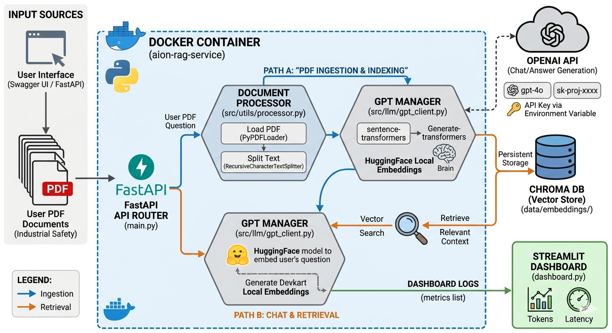
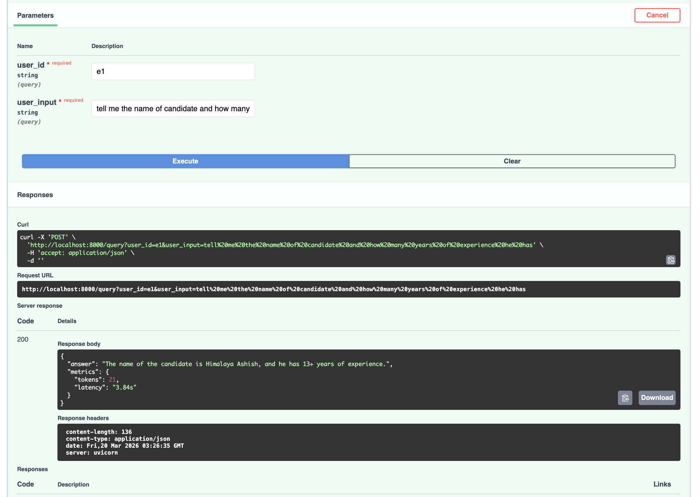

# generative_ai_project
generative_ai_project


# Aion Industrial RAG API

A Retrieval-Augmented Generation (RAG) API that lets you upload PDFs and ask questions about them. Built with FastAPI, LangChain, ChromaDB, and GPT-4o.

---

## Architecture



```
PDF Upload → PyPDF Loader → Text Splitter → HuggingFace Embeddings → ChromaDB
User Query → ChromaDB Retrieval (k=3) → GPT-4o → Answer
```

---

## Prerequisites

- Docker installed
- An OpenAI API key (get one at https://platform.openai.com/api-keys)

---

## Setup & Run

### 1. Rotate your API key (important!)
If you received this project with a key already in the `command` file, that key is compromised. Generate a new one at https://platform.openai.com/api-keys.

### 2. Create a `.env` file
```bash
echo "OPENAI_API_KEY=sk-your-key-here" > .env
```

### 3. Build the Docker image
```bash
docker build -t aion-rag-service .
```

### 4. Run the container
```bash
docker run -p 8000:8000 \
  --env-file .env \
  -v $(pwd)/data:/app/data \
  aion-rag-service \
  --model gpt-4.1-mini \
  --chunk_size 300 \
  --chunk_overlap 50
```

Optional CLI arguments:
- `--model` (default: `gpt-4o`, recommended: `gpt-4.1-mini`)
- `--chunk_size` (default: `1000`)
- `--strategy` (default: `recursive`, alternative: `character`)

---

## API Usage

### Swagger UI
Open http://localhost:8000/docs in your browser for an interactive API explorer.

### Upload PDFs
```bash
curl -X POST http://localhost:8000/upload-pdfs \
  -F "files=@/path/to/document.pdf"
```

### Ask a Question
```bash
curl -X POST "http://localhost:8000/query?user_id=alice&user_input=tell+me+the+name+of+candidate+and+how+many+years+of+experience+he+has?"
```

### Sample Output



### View Metrics
```bash
curl http://localhost:8000/metrics | python3 -m json.tool
```

---

## Bug Fixes Applied

| File | Status | Fix |
|------|--------|-----|
| `token_counter.py` | ✅ Fixed | Added `try/except KeyError` fallback encoding so newer models like `gpt-4.1-mini` that are not yet in tiktoken's registry don't cause a crash |
| `main.py` | ✅ Fixed | Removed `vectorstore.persist()` which was removed in chromadb >= 0.4.x and caused an `AttributeError` on every upload |
| `gpt_client.py` | ✅ Fixed | Moved `ConversationBufferMemory` from `create_chat_chain()` into `__init__()` so chat history persists across requests; replaced deprecated `langchain_community.embeddings.HuggingFaceEmbeddings` with `langchain_huggingface` |
| `requirements.txt` | ✅ Fixed | Unpinned `sentence-transformers` (was `==2.5.1`, caused dependency conflicts); added `langchain-huggingface==0.0.3` |
| Docker run command | ✅ Fixed | Use `--model gpt-4.1-mini` since `gpt-4o` is not available on all OpenAI projects |

---

## Troubleshooting

| Problem | Cause | Fix |
|--------|-------|-----|
| `AttributeError: persist` | Old chromadb + unfixed code | Make sure you're using the fixed `main.py` |
| `AuthenticationError` | Bad/expired API key | Regenerate key and update `.env` |
| `model_not_found` for gpt-4o | Project doesn't have access | Use `--model gpt-4.1-mini` instead |
| `No context found` | No PDFs uploaded yet | Call `/upload-pdfs` first |
| Port already in use | Something else on port 8000 | Change `-p 8000:8000` to `-p 8001:8000` and access via `localhost:8001` |
| Container exits immediately | Missing `.env` or bad key | Run `docker logs <container-id>` to inspect |
